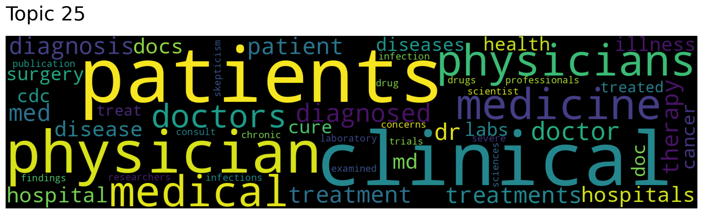
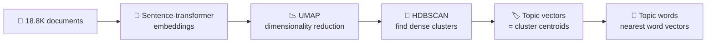
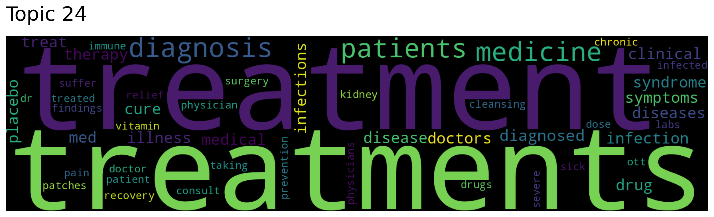
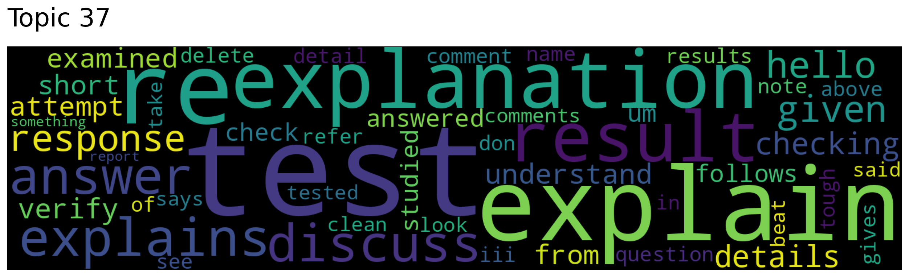

# 🧭 Topic Modeling & Semantic Search with Top2Vec

[](https://colab.research.google.com/github/MMujtabaX/Top2Vec/blob/main/Top2vec.ipynb)


Automatically discovering the topics hidden in **18,800 Usenet posts**, without choosing the number of topics or writing a single preprocessing rule, then using the same model for **semantic search** through a Gradio web app.

<p align="center">
  
</p>
<p align="center"><sub>One of 127 topics discovered automatically: clinical medicine.</sub></p>

## ⚙️ How Top2Vec Works



Documents, words and topics all live in **one shared vector space**, so the same model can:
- discover and describe topics
- find the topics nearest to any keywords
- find semantically similar words
- retrieve documents for a natural-language query

## 📊 Results on 20 Newsgroups

### 127 topics, discovered automatically
The dataset has 20 newsgroup labels; Top2Vec found **127 finer-grained topics**. For example, medicine splits into separate topics for clinical practice and for treatments.

### Topic search: *"medicine"*, *"doctor"*

| Topic | Top words | Verdict |
|-------|-----------|---------|
| 25 | patients, clinical, physician, medical, medicine, doctors, diagnosed | ✅ Clinical practice |
| 24 | treatment, treatments, diagnosis, medicine, patients, symptoms, therapy | ✅ Treatments |
| 37 | test, explain, re, explanation, result, answer, response | ⚠️ Generic "discussion" topic |

<p align="center">
  
  
</p>

Topic 37 is a useful lesson: embedding-based topic models often produce a few **generic topics** made of conversational words that appear in every thread. It's worth spotting them before drawing conclusions.

### Similar words: *"phone"*

| Word | Similarity |
|------|------------|
| phones | 0.88 |
| telephone | 0.81 |
| calling | 0.65 |
| calls | 0.65 |
| motorola | 0.64 |
| device | 0.62 |

### Semantic document search: *"do you know about football"*

20 Newsgroups has **no football group**, only baseball and hockey. The search still returned posts genuinely discussing **football and soccer**, found inside baseball threads. It matches on **meaning**, not on labels or exact keywords.

## 🖥️ Gradio Search App

```python
iface = gr.Interface(fn=query_documents,
                     inputs=gr.Textbox(lines=2, placeholder="Enter your query here..."),
                     outputs="text",
                     title="Top2Vec Document Query")
iface.launch(share=True)
```

Running it in Colab gives a temporary public link where anyone can search the collection from a browser.

## ⚖️ Top2Vec vs LDA

| | LDA (classic) | Top2Vec |
|--|---------------|---------|
| Number of topics | Must be chosen in advance | Found automatically |
| Preprocessing | Stopwords, lemmatization required | None needed |
| Word meaning | Bag of words, no semantics | Pretrained embeddings capture meaning |
| Semantic search | ❌ | ✅ Built in |
| Drawbacks | Sensitive to preprocessing | Occasional generic topics, less control |

## 🚀 Run It

Click the **Open in Colab** badge above and choose **Runtime → Run all**. 20 Newsgroups downloads through scikit-learn, and training takes a few minutes on a CPU.

```bash
pip install "top2vec[sentence_transformers]" scikit-learn gradio
```

## 🔮 Next Steps

- Reduce the 127 topics into broader themes with `model.hierarchical_topic_reduction()`
- Compare topics against the 20 newsgroup labels to measure topic purity
- Apply the model to recent data, such as COVID-19 tweets, to track topics over time

## 👤 Author

**Muhammad Mujtaba Khan Suri** — CS @ UBIT, University of Karachi
[GitHub](https://github.com/MMujtabaX)
